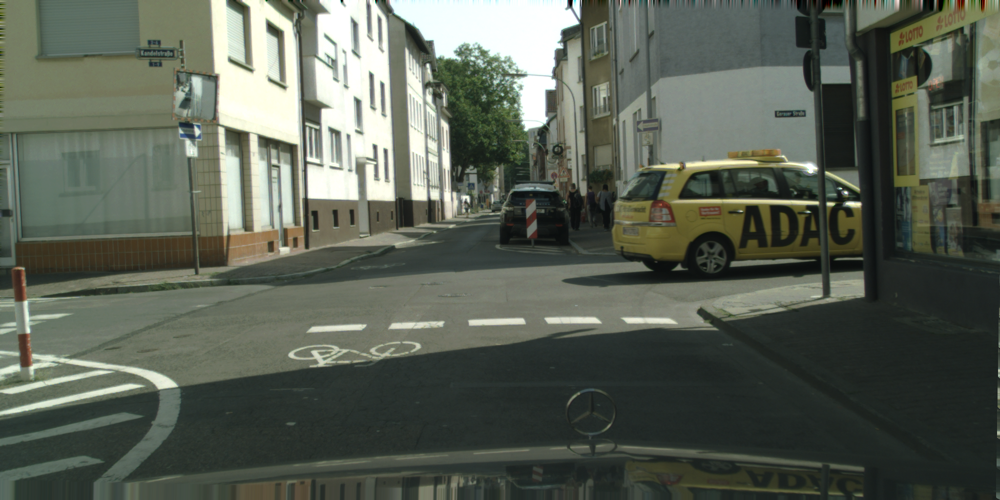
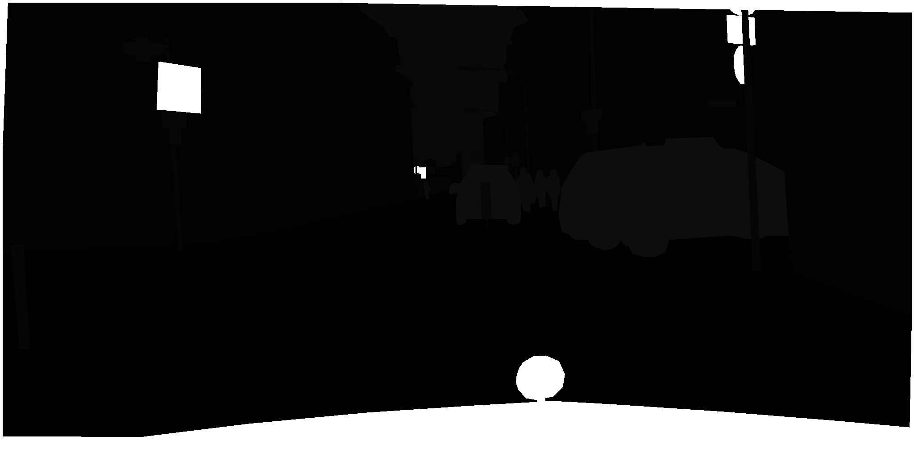
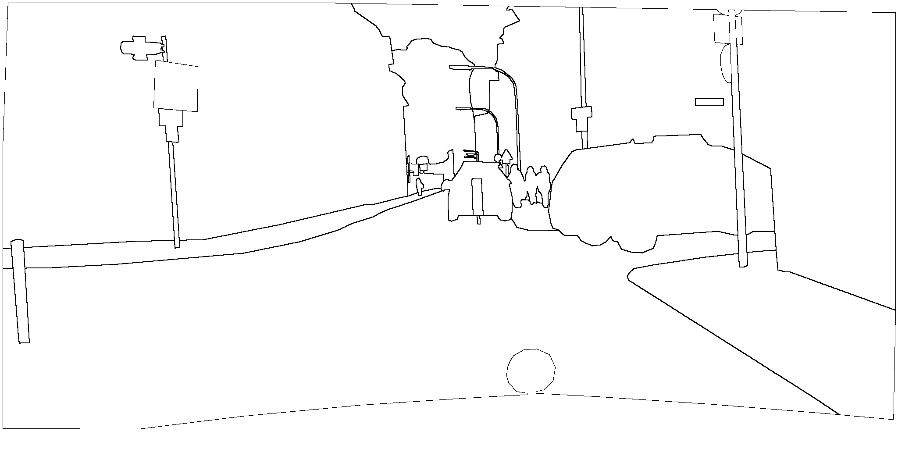
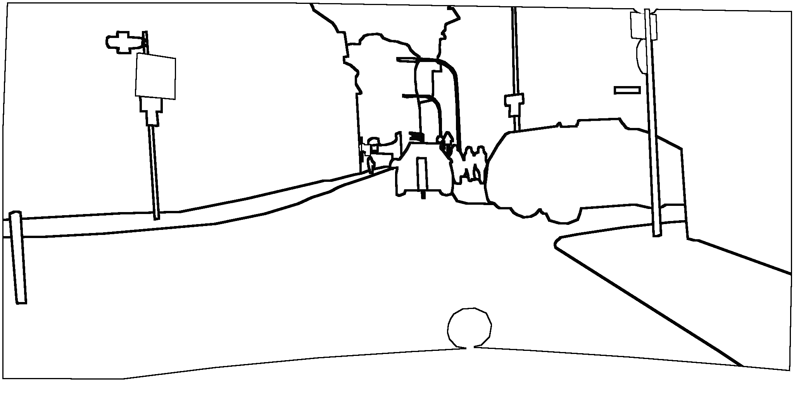
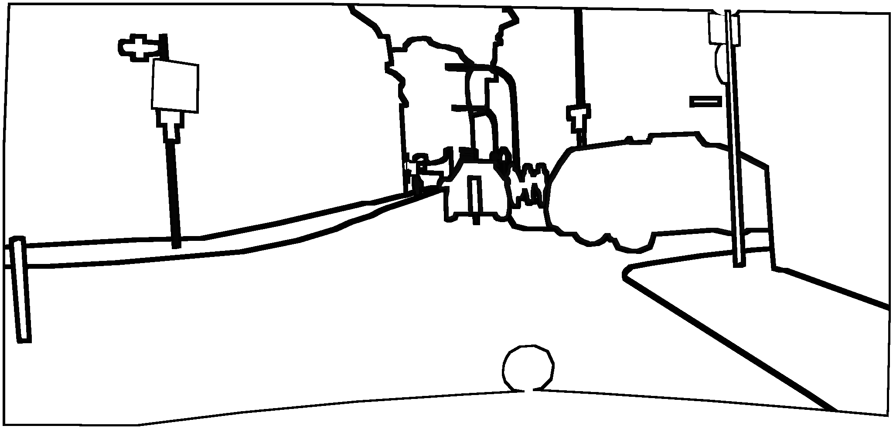

# segmentation-boundary-experiment

This code is to find pixels at the object boundary in labelmap and then dilate the boundary for the segmentation-boundary-experiment.
The dilation operate is based on APIs from OpenCV.

## Generating boundary labels

change the root paths and dilation kernel size and run:

'''
python findCountour.py
'''

## Computing mIoU and pixels accuracy

change the root paths and run:

'''
python miou.py
'''

## Examples

